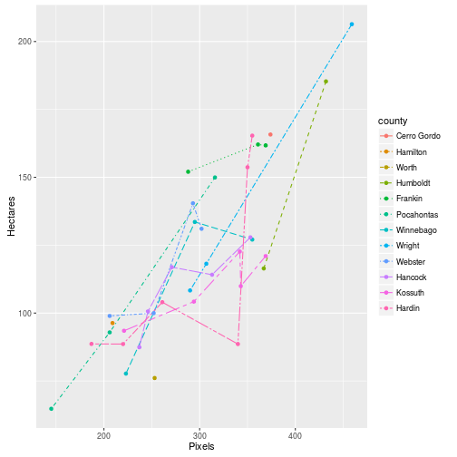
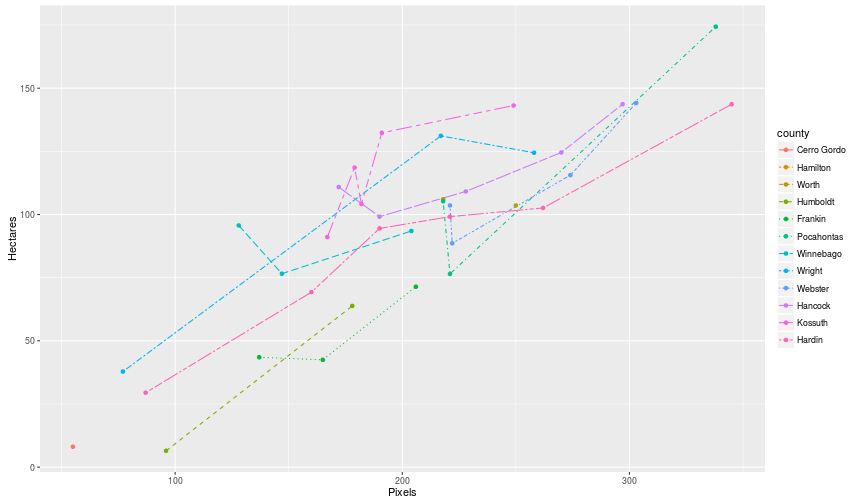

#Data from Battese, Harter, Fuller.


`dataCountyCropSurveySatellite` is an R data package that contains the data used in "Battese, George E., Rachel M. Harter, and Wayne A. Fuller. "An error-components model for prediction of county crop areas using survey and satellite data." Journal of the American Statistical Association 83.401 (1988): 28-36."


## Installation

```r
devtools::install_github("DanielBonnery/dataCountyCropSurveySatellite")
```

##Usage


```r
demo(plots,package="dataCountyCropSurveySatellite",echo=FALSE)
print(plot1)
```



```r
print(plot2)
```



```r
knitr::kable(crop)
```


|county      | countyn| crnsrvy| soysrvy| crnpxel| soypxel| crnmean| soymean|
|:-----------|-------:|-------:|-------:|-------:|-------:|-------:|-------:|
|Cerro Gordo |     545|  165.76|    8.09|     374|      55|  295.29|  189.70|
|Hamilton    |     566|   96.32|  106.03|     209|     218|  300.40|  196.65|
|Worth       |     394|   76.08|  103.60|     253|     250|  289.60|  205.28|
|Humboldt    |     424|  185.32|    6.47|     432|      96|  290.74|  220.22|
|Humboldt    |     424|  116.43|   63.82|     367|     178|  290.74|  220.22|
|Frankin     |     564|  162.08|   43.50|     361|     137|  318.21|  188.66|
|Frankin     |     564|  152.04|   71.43|     288|     206|  318.21|  188.66|
|Frankin     |     564|  161.75|   42.49|     369|     165|  318.21|  188.66|
|Pocahontas  |     570|   92.88|  105.26|     206|     218|  257.17|  247.13|
|Pocahontas  |     570|  149.94|   76.49|     316|     221|  257.17|  247.13|
|Pocahontas  |     570|   64.75|  174.34|     145|     338|  257.17|  247.13|
|Winnebago   |     402|  127.07|   95.67|     355|     128|  291.77|  185.37|
|Winnebago   |     402|  133.55|   76.57|     295|     147|  291.77|  185.37|
|Winnebago   |     402|   77.70|   93.48|     223|     204|  291.77|  185.37|
|Wright      |     567|  206.39|   37.84|     459|      77|  301.26|  221.36|
|Wright      |     567|  108.33|  131.12|     290|     217|  301.26|  221.36|
|Wright      |     567|  118.17|  124.44|     307|     258|  301.26|  221.36|
|Webster     |     687|   99.96|  144.15|     252|     303|  262.17|  247.09|
|Webster     |     687|  140.43|  103.60|     293|     221|  262.17|  247.09|
|Webster     |     687|   98.95|   88.59|     206|     222|  262.17|  247.09|
|Webster     |     687|  131.04|  115.58|     302|     274|  262.17|  247.09|
|Hancock     |     569|  114.12|   99.15|     313|     190|  314.28|  198.66|
|Hancock     |     569|  100.60|  124.56|     246|     270|  314.28|  198.66|
|Hancock     |     569|  127.88|  110.88|     353|     172|  314.28|  198.66|
|Hancock     |     569|  116.90|  109.14|     271|     228|  314.28|  198.66|
|Hancock     |     569|   87.41|  143.66|     237|     297|  314.28|  198.66|
|Kossuth     |     965|   93.48|   91.05|     221|     167|  298.65|  204.61|
|Kossuth     |     965|  121.00|  132.33|     369|     191|  298.65|  204.61|
|Kossuth     |     965|  109.91|  143.14|     343|     249|  298.65|  204.61|
|Kossuth     |     965|  122.66|  104.13|     342|     182|  298.65|  204.61|
|Kossuth     |     965|  104.21|  118.57|     294|     179|  298.65|  204.61|
|Hardin      |     556|   88.59|  102.59|     220|     262|  325.99|  177.05|
|Hardin      |     556|   88.59|   29.46|     340|      87|  325.99|  177.05|
|Hardin      |     556|  165.35|   69.28|     355|     160|  325.99|  177.05|
|Hardin      |     556|  104.00|   99.15|     261|     221|  325.99|  177.05|
|Hardin      |     556|   88.63|  143.66|     187|     345|  325.99|  177.05|
|Hardin      |     556|  153.70|   94.49|     350|     190|  325.99|  177.05|
