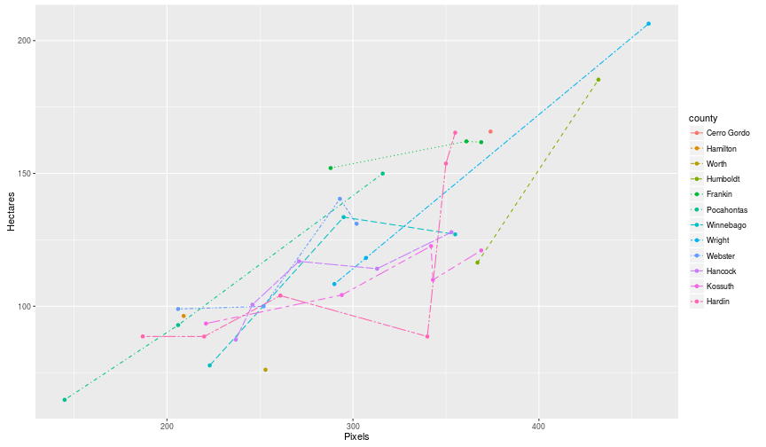

#Data from "Battese, George E., Rachel M. Harter, and Wayne A. Fuller. "An error-components model for prediction of county crop areas using survey and satellite data." Journal of the American Statistical Association 83.401 (1988): 28-36."

`dataCountyCropSurveySatellite` is an R data package that contains the data used in "Battese, George E., Rachel M. Harter, and Wayne A. Fuller. "An error-components model for prediction of county crop areas using survey and satellite data." Journal of the American Statistical Association 83.401 (1988): 28-36."


## Installation

```r
devtools::install_github("DanielBonnery/dataCountyCropSurveySatellite")
```

##Usage


```r
library(dataCountyCropSurveySatellite)
demo(plots,package="dataCountyCropSurveySatellite",echo=FALSE)
print(plot1)
```


